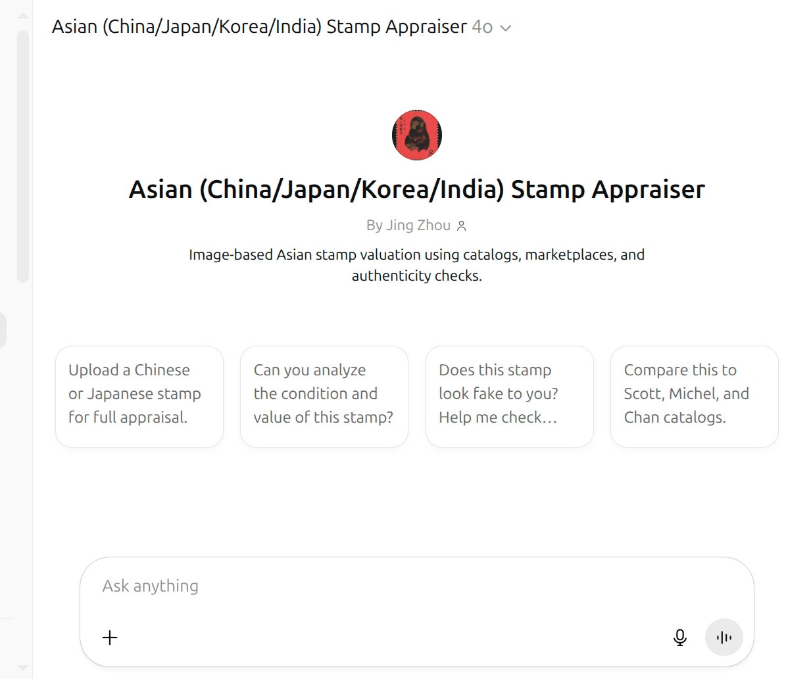

# Asian Stamp Appraiser GPT

**Custom GPT for visual-based stamp valuation — focused on Asian philately (China, Japan, Korea, Taiwan, India).**

## 🔍 What It Does
This GPT is a virtual philatelist that evaluates individual stamps and collections using uploaded images and online catalogs. It recognizes visual details like:
- Watermarks
- Perforation types
- Cancellations
- Overprints
- Stamp condition (centering, creases, gum presence, etc.)

It provides:
- **Accurate value estimates** based on condition + catalog references
- **Catalog lookups** from Scott, Michel, Chan, and others
- **Real-world pricing** from sources like eBay, Rakuten, and regional stamp websites
- **Forgery detection tips** and **grading visual guide**

## 🖼️ Use Cases
- Identify and value a single Asian stamp
- Detect forged or altered stamps
- Understand stamp grading visually
- Explore historical context and significance of regional issues

## 🚀 Try It Here

## 🧠 How It Works
- Accepts uploaded images and analyzes visual condition
- Pulls catalog values from trusted philatelic databases
- Searches current sales records for realistic pricing

Includes a **valuation table**:
1. What the object is  
2. Whether it has special value  
3. Estimated value range  
4. Why it’s valuable or not  
5. Reference links

## 🛠️ Technical Highlights
- GPT-4 with image input capability
- Catalog reference mapping (Scott, Michel, Chan)
- Regional data scraping (Japan: yushu.or.jp, China: e-stamps.cn)
- Market data aggregation (eBay, Rakuten, CamelCamelCamel)

## 📸 Screenshots & Demos

## 📂 File Overview
- `gpt-config/`: Prompt & instruction files
- `examples/`: Sample prompts, use cases, and sample image analyses
- `screenshots/`: UI images or usage demo
- `links.md`: Marketplaces and catalog links used
- `LICENSE`: Open-source usage terms

## 🗣️ About the Creator
Created by [Jing Zhou]
Specializing in custom GPT development, RAG pipelines, and multimodal LLMs.

---

**Note:** This GPT does not provide investment advice. It’s for hobbyist and research use.

